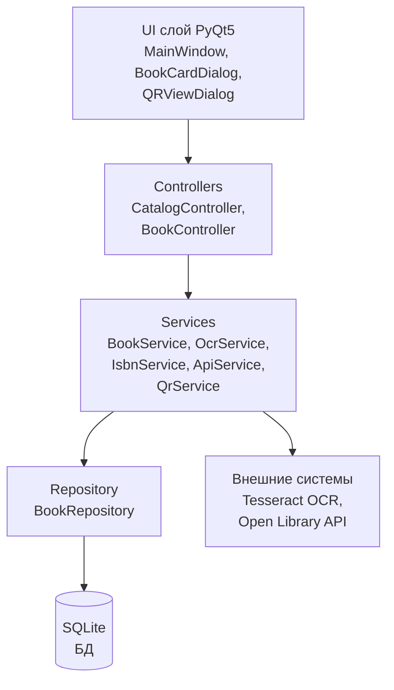
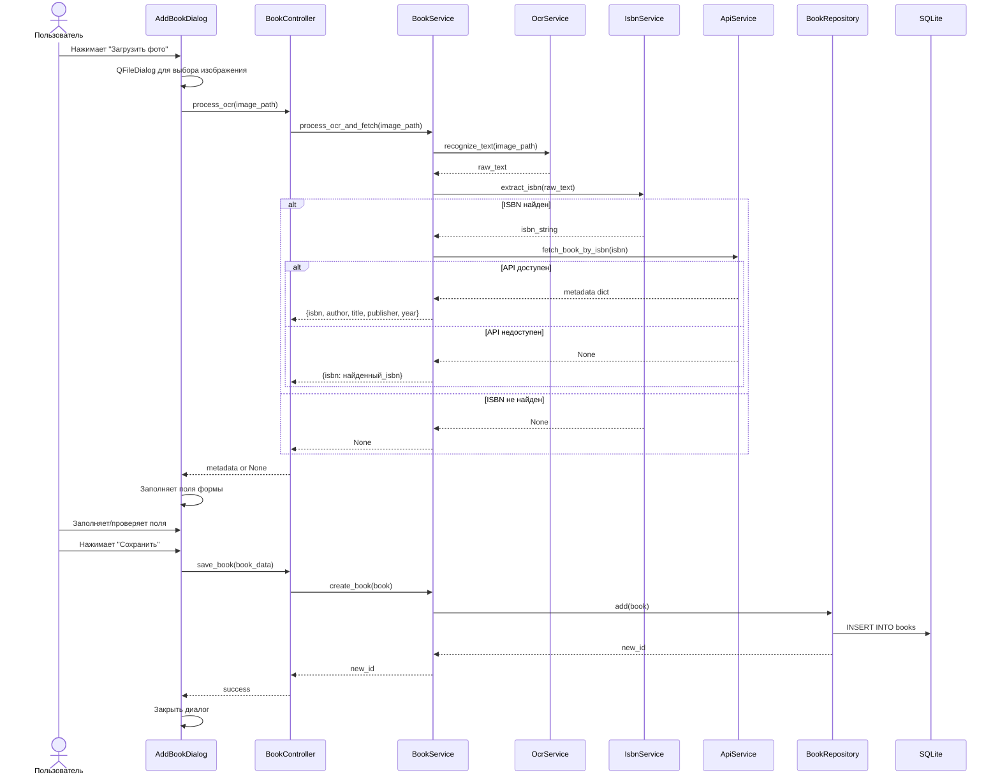
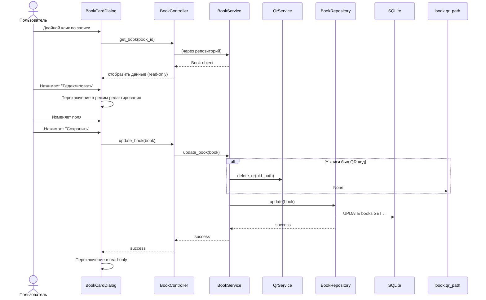
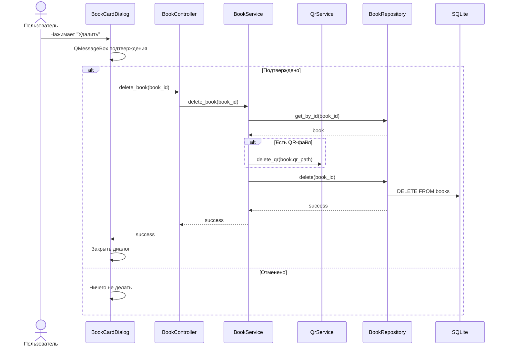

# Архитектура проекта «Картотека книжной библиотеки с OCR-распознаванием»

## 1. Общая структура проекта

```
library_catalog/
├── app/                          # Основной пакет приложения
│   ├── __init__.py
│   ├── main.py                   # Точка входа, запуск приложения
│   │
│   ├── models/                   # Модели данных (DTO / Dataclasses)
│   │   ├── __init__.py
│   │   └── book.py               # Book dataclass
│   │
│   ├── db/                       # Data Access Layer (Repository)
│   │   ├── __init__.py
│   │   ├── database.py           # Подключение к SQLite, инициализация схемы
│   │   └── book_repository.py    # CRUD-операции для таблицы books
│   │
│   ├── services/                 # Бизнес-логика (сервисы)
│   │   ├── __init__.py
│   │   ├── ocr_service.py        # OCR-обработка изображений (Tesseract)
│   │   ├── isbn_service.py       # Извлечение ISBN из текста (регулярки)
│   │   ├── api_service.py        # Запросы к Open Library API
│   │   ├── qr_service.py         # Генерация QR-кодов
│   │   └── book_service.py       # Оркестрация: создание/редактирование книг
│   │
│   ├── controllers/              # Связующее звено между UI и сервисами
│   │   ├── __init__.py
│   │   ├── catalog_controller.py # Логика для главного окна (таблица, поиск, фильтры)
│   │   └── book_controller.py    # Логика для карточки книги (создание, редактирование)
│   │
│   └── ui/                       # Слой представления (PyQt5)
│       ├── __init__.py
│       ├── main_window.py        # Главное окно: таблица, поиск, фильтры, кнопки
│       ├── book_card_dialog.py   # Диалог карточки книги (просмотр/редактирование)
│       ├── qr_view_dialog.py     # Окно просмотра QR-кода
│       ├── add_book_dialog.py    # Диалог добавления новой книги
│       └── styles/               # Стили для современного красивого UI
│           ├── __init__.py
│           └── theme.py          # QSS-стилизация
│
├── tests/                        # Модульные тесты (pytest)
│   ├── __init__.py
│   ├── conftest.py               # Фикстуры pytest (БД, моки)
│   ├── test_database.py          # Тесты работы с БД
│   ├── test_book_repository.py   # Тесты CRUD и поиска
│   ├── test_isbn_service.py      # Тесты извлечения ISBN из текста
│   ├── test_qr_service.py        # Тесты генерации QR-кодов
│   └── test_book_service.py      # Тесты бизнес-логики
│
├── resources/                    # Ресурсы (иконки, примеры изображений)
│   └── sample/                   # Примеры изображений для тестирования OCR
│
├── requirements.txt              # Зависимости Python
├── Dockerfile                    # Docker-образ
├── docker-compose.yml            # Docker Compose
├── .bandit.yml                   # Конфигурация Bandit
├── pyproject.toml                # Метаданные проекта, настройки pytest
└── README.md                     # Инструкции по запуску и проверкам
```

---

## 2. Многослойная архитектура

### 2.1. Схема взаимодействия слоёв



### 2.2. Описание слоёв

| Слой | Назначение | Ключевые принципы |
|------|-----------|-------------------|
| **UI** | Отображение данных, обработка пользовательского ввода | Только PyQt5 виджеты. Никакой бизнес-логики. Вызовы только к Controllers. |
| **Controllers** | Приём событий от UI, координация сервисов | Тонкий слой-посредник. Преобразует UI-события в вызовы сервисов. |
| **Services** | Бизнес-логика, работа с внешними системами | Изолированная логика. Сервисы не знают о PyQt5. |
| **Repository** | Доступ к данным, CRUD-операции | Только SQL-запросы. Никакой бизнес-логики. |
| **Models** | Dataclasses для передачи данных между слоями | Plain Python-объекты. Нет ORM-маппинга. |

---

## 3. Модели данных

### 3.1. Book dataclass

```python
from dataclasses import dataclass, field
from typing import Optional

@dataclass
class Book:
    id: Optional[int] = None
    isbn: Optional[str] = None
    author: str = ""
    title: str = ""
    publisher: Optional[str] = None
    year: Optional[int] = None
    udc: Optional[str] = None
    bbk: Optional[str] = None
    author_mark: Optional[str] = None
    quantity: int = 1
    qr_path: Optional[str] = None
```

### 3.2. Таблица SQLite

```sql
CREATE TABLE IF NOT EXISTS books (
    id INTEGER PRIMARY KEY AUTOINCREMENT,
    isbn TEXT UNIQUE,
    author TEXT NOT NULL,
    title TEXT NOT NULL,
    publisher TEXT,
    year INTEGER,
    udc TEXT,
    bbk TEXT,
    author_mark TEXT,
    quantity INTEGER NOT NULL DEFAULT 1,
    qr_path TEXT
);
```

---

## 4. Data Access Layer (Repository)

### 4.1. [`app/db/database.py`](app/db/database.py)

- Класс `Database` — синглтон для подключения к SQLite.
- Метод `get_connection()` — возвращает соединение (с `row_factory = sqlite3.Row`).
- Метод `initialize()` — создаёт таблицу `books` при первом запуске.

### 4.2. [`app/db/book_repository.py`](app/db/book_repository.py)

Класс `BookRepository`:

| Метод | Описание |
|-------|----------|
| `get_all() -> list[Book]` | Получить все книги |
| `get_by_id(book_id: int) -> Book \| None` | Получить книгу по ID |
| `search(query: str) -> list[Book]` | Поиск по ISBN, автору, названию, издательству |
| `filter(year: int \| None, udc: str \| None, bbk: str \| None) -> list[Book]` | Фильтрация |
| `add(book: Book) -> int` | Добавить книгу, вернуть ID |
| `update(book: Book)` | Обновить книгу |
| `delete(book_id: int)` | Удалить книгу |
| `get_by_isbn(isbn: str) -> Book \| None` | Поиск по ISBN (для проверки уникальности) |

---

## 5. Сервисы

### 5.1. [`app/services/ocr_service.py`](app/services/ocr_service.py) — OCR-сервис

```python
class OcrService:
    def recognize_text(self, image_path: str) -> str:
        """
        Запускает Tesseract OCR на изображении.
        Возвращает распознанный текст.
        Поддерживает кириллицу (rus + eng).
        """
```

- Использует `pytesseract`.
- Языки: `rus+eng`.
- Предобработка изображения: перевод в оттенки серого, бинаризация (Otsu), повышение контраста.

### 5.2. [`app/services/isbn_service.py`](app/services/isbn_service.py) — Извлечение ISBN

```python
class IsbnService:
    def extract_isbn(self, text: str) -> Optional[str]:
        """
        Извлекает ISBN-10 или ISBN-13 из текста с помощью регулярных выражений.
        Возвращает первый найденный ISBN или None.
        """
```

- Регулярные выражения для ISBN-10 и ISBN-13:
  - ISBN-13: `(?:ISBN[-]?(?:13)?[:]?\s*)?(97[89][-\s]?\d{1,5}[-\s]?\d{1,7}[-\s]?\d{1,6}[-\s]?\d)`
  - ISBN-10: `(?:ISBN[-]?(?:10)?[:]?\s*)?(\d[-\s]?\d{1,5}[-\s]?\d{1,7}[-\s]?\d{1,6}[-\s]?[\dX])`
- Очистка от разделителей (дефисы, пробелы).

### 5.3. [`app/services/api_service.py`](app/services/api_service.py) — Open Library API

```python
class ApiService:
    def fetch_book_by_isbn(self, isbn: str) -> Optional[dict]:
        """
        Запрашивает метаданные книги через Open Library API.
        URL: https://openlibrary.org/isbn/{isbn}.json
        Возвращает словарь с полями: author, title, publisher, year
        или None при ошибке/недоступности.
        """
```

- HTTP-запрос через `requests`.
- Обработка таймаута (5 сек).
- Обработка HTTP-ошибок (404, 503 и т.д.).
- Маппинг ответа API на поля книги.

### 5.4. [`app/services/qr_service.py`](app/services/qr_service.py) — Генерация QR

```python
class QrService:
    def generate_qr(self, book_id: int, isbn: Optional[str], output_dir: str) -> str:
        """
        Генерирует QR-код с JSON-данными:
        {"id": <book_id>, "isbn": <isbn или null>}
        Сохраняет PNG в output_dir.
        Возвращает путь к файлу.
        """
    
    def delete_qr(self, qr_path: str) -> None:
        """Удаляет файл QR-кода с диска."""
```

- Использует библиотеку `qrcode`.
- Формат данных: JSON.
- Имя файла: `qr_book_{book_id}.png`.

### 5.5. [`app/services/book_service.py`](app/services/book_service.py) — Оркестратор

```python
class BookService:
    def __init__(self, repo: BookRepository, api: ApiService, qr: QrService):
        ...
    
    def create_book(self, book: Book) -> int:
        """Создать книгу (валидация + сохранение)."""
    
    def update_book(self, book: Book) -> None:
        """Обновить книгу + удалить QR-код если был (данные могли измениться)."""
    
    def delete_book(self, book_id: int) -> None:
        """Удалить книгу + удалить QR-файл."""
    
    def search_books(self, query: str) -> list[Book]:
        """Поиск книг."""
    
    def filter_books(self, year: int | None, udc: str | None, bbk: str | None) -> list[Book]:
        """Фильтрация книг."""
    
    def process_ocr_and_fetch(self, image_path: str) -> Optional[dict]:
        """
        Полный пайплайн OCR:
        1. Распознать текст через OcrService
        2. Извлечь ISBN через IsbnService
        3. Если ISBN найден -> запрос к ApiService
        4. Вернуть метаданные или None
        """
```

---

## 6. Контроллеры

### 6.1. [`app/controllers/catalog_controller.py`](app/controllers/catalog_controller.py)

```python
class CatalogController:
    def __init__(self, book_service: BookService):
        ...
    
    def load_catalog(self) -> list[Book]:
        """Загрузить все книги."""
    
    def search(self, query: str) -> list[Book]:
        """Поиск по каталогу."""
    
    def apply_filters(self, year, udc, bbk) -> list[Book]:
        """Применить фильтры."""
    
    def delete_book(self, book_id: int) -> bool:
        """Удалить книгу с подтверждением."""
```

### 6.2. [`app/controllers/book_controller.py`](app/controllers/book_controller.py)

```python
class BookController:
    def __init__(self, book_service: BookService):
        ...
    
    def get_book(self, book_id: int) -> Book:
        """Получить данные книги."""
    
    def save_book(self, book: Book) -> int:
        """Сохранить новую книгу."""
    
    def update_book(self, book: Book) -> None:
        """Обновить существующую книгу."""
    
    def process_ocr(self, image_path: str) -> Optional[dict]:
        """Запустить OCR и получить метаданные."""
    
    def generate_qr(self, book_id: int, isbn: Optional[str]) -> str:
        """Сгенерировать QR-код."""
```

---

## 7. UI-компоненты (PyQt5)

### 7.1. [`app/ui/main_window.py`](app/ui/main_window.py) — Главное окно

```
┌─────────────────────────────────────────────────────┐
│  🔍 [________________________] [Поиск]  [Добавить] │
│  Год: [____]  УДК: [____]  ББК: [____] [Применить] │
├─────────────────────────────────────────────────────┤
│  ┌─────┬──────┬───────┬───────────┬────┬────┬────┐ │
│  │ ID  │ ISBN │ Автор│ Название  │Год │УДК │ББК │ │
│  ├─────┼──────┼───────┼───────────┼────┼────┼────┤ │
│  │ ... │ ...  │ ...   │ ...       │ ...│ ...│ ...│ │
│  └─────┴──────┴───────┴───────────┴────┴────┴────┘ │
└─────────────────────────────────────────────────────┘
```

- `QTableView` + `QSortFilterProxyModel` для таблицы.
- Строка поиска (`QLineEdit`) + кнопка «Поиск».
- Панель фильтров (`QSpinBox` для года, `QLineEdit` для УДК и ББК).
- Кнопка «Добавить книгу».
- Двойной клик по строке → открытие карточки книги.

### 7.2. [`app/ui/book_card_dialog.py`](app/ui/book_card_dialog.py) — Карточка книги

Режимы:
- **Просмотр** (read-only): все поля заблокированы, кнопки: Редактировать, Удалить, Создать QR-код, Закрыть.
- **Редактирование**: поля разблокированы, кнопки: Сохранить, Отмена.

Поля формы:
- ISBN (`QLineEdit`)
- Автор (`QLineEdit`)
- Название (`QLineEdit`)
- Издательство (`QLineEdit`)
- Год (`QSpinBox`)
- УДК (`QLineEdit`)
- ББК (`QLineEdit`)
- Авторский знак (`QLineEdit`)
- Количество экземпляров (`QSpinBox`)

### 7.3. [`app/ui/add_book_dialog.py`](app/ui/add_book_dialog.py) — Добавление книги

- Те же поля, что в карточке, но все пустые.
- Кнопка «Загрузить фото» → запуск OCR.
- Кнопка «Сохранить».
- Кнопка «Отмена».

### 7.4. [`app/ui/qr_view_dialog.py`](app/ui/qr_view_dialog.py) — Просмотр QR

- `QLabel` с изображением QR-кода.
- Кнопка «Сохранить PNG» (выбор директории через `QFileDialog`).
- Кнопка «Закрыть».

### 7.5. [`app/ui/styles/theme.py`](app/ui/styles/theme.py) — Стилизация

- Современная цветовая схема (светлая/тёмная — светлая по умолчанию).
- QSS-стили для:
  - `QMainWindow`, `QDialog` — фоны, отступы.
  - `QPushButton` — скруглённые углы, hover-эффекты, градиенты.
  - `QLineEdit`, `QSpinBox` — современные поля ввода.
  - `QTableView` — чередование цветов строк, выделение.
  - `QGroupBox` — стилизованные рамки.

---

## 8. Потоки данных (Data Flow)

### 8.1. Добавление книги через OCR



### 8.2. Редактирование книги



### 8.3. Удаление книги



---

## 9. Тестирование (pytest)

### 9.1. [`tests/conftest.py`](tests/conftest.py) — Фикстуры

- `in_memory_db` — SQLite `:memory:` для тестов БД.
- `book_repository` — репозиторий на in-memory БД.
- `sample_book` — тестовый объект Book.
- `sample_isbn_text` — текст с ISBN для тестов OCR.
- `mock_api_service` — мок для Open Library API.

### 9.2. [`tests/test_database.py`](tests/test_database.py)

- `test_initialize_creates_table` — проверка создания таблицы.
- `test_connection_is_valid` — проверка подключения.

### 9.3. [`tests/test_book_repository.py`](tests/test_book_repository.py)

- `test_add_book` — добавление книги.
- `test_get_by_id` — получение по ID.
- `test_get_all` — получение всех.
- `test_search_by_isbn` — поиск по ISBN.
- `test_search_by_author` — поиск по автору.
- `test_search_by_title` — поиск по названию.
- `test_search_by_publisher` — поиск по издательству.
- `test_filter_by_year` — фильтр по году.
- `test_filter_by_udc` — фильтр по УДК.
- `test_filter_by_bbk` — фильтр по ББК.
- `test_update_book` — обновление книги.
- `test_delete_book` — удаление книги.
- `test_get_by_isbn` — поиск по ISBN (уникальность).

### 9.4. [`tests/test_isbn_service.py`](tests/test_isbn_service.py)

- `test_extract_isbn13_with_prefix` — ISBN-13 с префиксом "ISBN".
- `test_extract_isbn13_without_prefix` — ISBN-13 без префикса.
- `test_extract_isbn10_with_prefix` — ISBN-10 с префиксом.
- `test_extract_isbn10_without_prefix` — ISBN-10 без префикса.
- `test_extract_isbn_with_hyphens` — ISBN с дефисами.
- `test_extract_isbn_with_spaces` — ISBN с пробелами.
- `test_extract_no_isbn` — текст без ISBN.
- `test_extract_isbn_from_noisy_text` — ISBN в зашумлённом тексте.

### 9.5. [`tests/test_qr_service.py`](tests/test_qr_service.py)

- `test_generate_qr_creates_file` — создаётся PNG-файл.
- `test_generate_qr_with_isbn` — QR с ISBN.
- `test_generate_qr_without_isbn` — QR с null ISBN.
- `test_generate_qr_content` — проверка содержимого QR (декодировать и проверить JSON).
- `test_delete_qr_removes_file` — удаление файла.

### 9.6. [`tests/test_book_service.py`](tests/test_book_service.py)

- `test_process_ocr_and_fetch_success` — полный пайплайн OCR+API успешен.
- `test_process_ocr_and_fetch_no_isbn` — ISBN не найден.
- `test_process_ocr_and_fetch_api_unavailable` — API недоступен.
- `test_create_book` — создание книги через сервис.
- `test_update_book_with_qr` — обновление с пересозданием QR.
- `test_delete_book_with_qr` — удаление с QR-файлом.

---

## 10. Docker-инфраструктура

### 10.1. [`Dockerfile`](Dockerfile)

```dockerfile
FROM python:3.11-slim

# Установка системных зависимостей для Tesseract + кириллица
RUN apt-get update && apt-get install -y \
    tesseract-ocr \
    tesseract-ocr-rus \
    tesseract-ocr-eng \
    libgl1-mesa-glx \
    libglib2.0-0 \
    && rm -rf /var/lib/apt/lists/*

WORKDIR /app

COPY requirements.txt .
RUN pip install --no-cache-dir -r requirements.txt

COPY . .

# Приложение требует GUI (X11/Wayland), поэтому используем xvfb
RUN apt-get update && apt-get install -y xvfb && rm -rf /var/lib/apt/lists/*

CMD ["xvfb-run", "python", "-m", "app.main"]
```

### 10.2. [`docker-compose.yml`](docker-compose.yml)

```yaml
version: '3.8'

services:
  library-catalog:
    build: .
    volumes:
      - ./data:/app/data          # Для сохранения БД и QR-кодов
      - /tmp/.X11-unix:/tmp/.X11-unix  # Для GUI (Linux)
    environment:
      - DISPLAY=${DISPLAY:-:0}
      - TESSDATA_PREFIX=/usr/share/tesseract-ocr/4.00/tessdata
    stdin_open: true
    tty: true
```

---

## 11. SAST и проверка зависимостей

### 11.1. Bandit (`pip install bandit`)

```bash
bandit -r app/ -c .bandit.yml
```

[`.bandit.yml`](.bandit.yml):
```yaml
skips: ['B101']  # Разрешаем assert в коде (не тесты)
```

### 11.2. pip-audit (`pip install pip-audit`)

```bash
pip-audit -r requirements.txt
```

### 11.3. Запуск всех проверок (Makefile или скрипт)

```bash
# Установка
pip install -r requirements.txt
pip install bandit pip-audit pytest

# Проверки
bandit -r app/
pip-audit -r requirements.txt
pytest tests/ -v --cov=app
```

---

## 12. Зависимости (requirements.txt)

```
PyQt5>=5.15.0
pytesseract>=0.3.10
Pillow>=10.0.0
requests>=2.31.0
qrcode[pil]>=7.4.2
pytest>=7.4.0
pytest-cov>=4.1.0
bandit>=1.7.5
pip-audit>=2.7.0
```

---

## 13. План реализации по этапам

### Этап 1: Базовая структура и БД
1. Создать структуру директорий проекта.
2. Реализовать [`app/db/database.py`](app/db/database.py) — подключение к SQLite, инициализация.
3. Реализовать [`app/models/book.py`](app/models/book.py) — dataclass Book.
4. Реализовать [`app/db/book_repository.py`](app/db/book_repository.py) — CRUD + поиск + фильтры.
5. Написать тесты: `test_database.py`, `test_book_repository.py`.

### Этап 2: Сервисы
6. Реализовать [`app/services/isbn_service.py`](app/services/isbn_service.py) — извлечение ISBN.
7. Реализовать [`app/services/ocr_service.py`](app/services/ocr_service.py) — Tesseract OCR.
8. Реализовать [`app/services/api_service.py`](app/services/api_service.py) — Open Library API.
9. Реализовать [`app/services/qr_service.py`](app/services/qr_service.py) — генерация QR.
10. Реализовать [`app/services/book_service.py`](app/services/book_service.py) — оркестратор.
11. Написать тесты: `test_isbn_service.py`, `test_qr_service.py`, `test_book_service.py`.

### Этап 3: UI (PyQt5)
12. Реализовать [`app/ui/styles/theme.py`](app/ui/styles/theme.py) — стилизация.
13. Реализовать [`app/ui/main_window.py`](app/ui/main_window.py) — главное окно.
14. Реализовать [`app/ui/add_book_dialog.py`](app/ui/add_book_dialog.py) — добавление книги.
15. Реализовать [`app/ui/book_card_dialog.py`](app/ui/book_card_dialog.py) — карточка книги.
16. Реализовать [`app/ui/qr_view_dialog.py`](app/ui/qr_view_dialog.py) — просмотр QR.

### Этап 4: Контроллеры и интеграция
17. Реализовать [`app/controllers/catalog_controller.py`](app/controllers/catalog_controller.py).
18. Реализовать [`app/controllers/book_controller.py`](app/controllers/book_controller.py).
19. Реализовать [`app/main.py`](app/main.py) — точка входа.
20. Интеграционное тестирование всех компонентов.

### Этап 5: Инфраструктура
21. Создать [`requirements.txt`](requirements.txt).
22. Создать [`Dockerfile`](Dockerfile) и [`docker-compose.yml`](docker-compose.yml).
23. Создать [`.bandit.yml`](.bandit.yml).
24. Написать [`README.md`](README.md) с инструкциями.
25. Финальное тестирование и проверка SAST.

### Этап 6: Доработка логики QR-кодов
26. **Исправить [`app/services/book_service.py`](app/services/book_service.py):** в методе `update_book()` — удалять QR-файл и обнулять `qr_path` в объекте книги, **не создавая** новый QR-код. Данные книги могли измениться (ISBN, автор и т.д.), поэтому старый QR-код более не актуален.
27. **Исправить [`app/ui/book_card_dialog.py`](app/ui/book_card_dialog.py):** в методе `_populate_fields()` — добавить проверку физического существования файла QR-кода через `os.path.exists()`. Надпись "✅ QR-код" показывать только если файл реально существует на диске, а не только путь в БД.